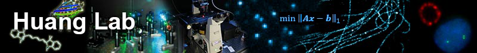
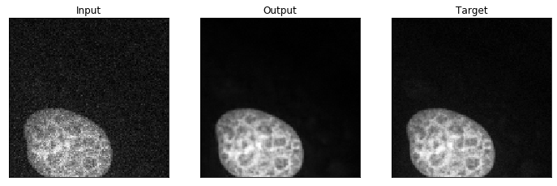
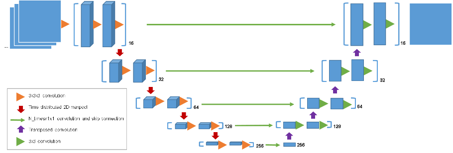

<p>
<center>

  </center>
</p>

# Image denoising for fluorescence microscopy by self-supervised transfer learning

## Overview



This repo contains code used for the timeUnet neural network. Based on the [Unet](https://arxiv.org/abs/1505.04597) architecture, this model was designed to denoise signal-dependent [Poisson Noise](https://en.wikipedia.org/wiki/Shot_noise), the largest source of noise in cellular-level fluorescence microscopy.



The network was initially trained on the [Fluorescence Microscopy Dataset (FMD)](https://curate.nd.edu/show/und:f4752f78z6t). In our study, further tuning is done by training on application specific data. Pixel masking, as see in [noise2self](https://github.com/czbiohub/noise2self) was also explored to produce even better denoising results.

## Getting Started

### Prerequisites

The code was developed using the following dependencies. Mileage may vary with future version, especially with future versions of [Keras](https://www.pyimagesearch.com/2019/10/21/keras-vs-tf-keras-whats-the-difference-in-tensorflow-2-0/) and [TensorFlow](https://www.tensorflow.org/guide/effective_tf2).

- ```Python==3.6```
- ```Keras==2.2.4```
- ```numpy==1.16.0```
- ```Pillow==5.4.1```
- ```scikit-image==0.14.2```
- ```scikit-learn==0.21.2```
- ```tensorflow-gpu==1.12.0```
- ```torch==1.1.0```
- ```torchvision==0.3.0```

## Usage

### Pretrained Models

Pretrained models can be found in ```Self-Supervised Training with Noise2Self/notebooks/trained_models/```. This folder contains 2 pretrained models which can be used:

- ```FMD_epoch50_model```: Model trained on the entire FMD dataset, containing 50 frames for 240 field-of-views. Synthetically generated noisy images were also generated for training.
- ```MT_simulation_iter1000_model```: Refined FMD model specificaly denoising microtubule images. Training was performed on masked high signal-to-noise confocal microtubule images with synthetic noise applied.

### Other Applications

We suggest taking a similar approach to our paper when denoising in your applications. Using ```FMD_epoch50_model```, continue to train with noisy and clean image pairs from your specific domain. We saw great success using the noise2self method of masked image-pairing for task-specific denoising. See the paper and the noise2self code for more details.

## Contact

Questions/concerns should be initiated via Issues. For ideas/potential collaborations/etc. feel free to reach out at [bo.huang@ucsf.edu](bo.huang@ucsf.edu). See our [website](huanglab.ucsf.edu) for information about other projects.

## Acknowledgments

- [Yina Wang](https://github.com/yinawang28/) for developing the code
- [Emaad Khwaja](https://github.com/EmaadKhwaja/) for review and preparation 


### Citation

Please use the following citation if you decide to use in your research:

```
Image denoising for fluorescence microscopy by self-supervised transfer learning
Yina Wang, Henry Pinkard, Shuqin Zhou, Laura Waller, Bo Huang
bioRxiv 2021.02.01.429188; doi: https://doi.org/10.1101/2021.02.01.429188
```

### License 

```
Copyright (c) 2021 Bo Huang and others

Permission is hereby granted, free of charge, to any person obtaining
a copy of this software and associated documentation files (the
"Software"), to deal in the Software without restriction, including
without limitation the rights to use, copy, modify, merge, publish,
distribute, sublicense, and/or sell copies of the Software, and to
permit persons to whom the Software is furnished to do so, subject to
the following conditions:

The above copyright notice and this permission notice shall be
included in all copies or substantial portions of the Software.

THE SOFTWARE IS PROVIDED "AS IS", WITHOUT WARRANTY OF ANY KIND,
EXPRESS OR IMPLIED, INCLUDING BUT NOT LIMITED TO THE WARRANTIES OF
MERCHANTABILITY, FITNESS FOR A PARTICULAR PURPOSE AND
NONINFRINGEMENT. IN NO EVENT SHALL THE AUTHORS OR COPYRIGHT HOLDERS BE
LIABLE FOR ANY CLAIM, DAMAGES OR OTHER LIABILITY, WHETHER IN AN ACTION
OF CONTRACT, TORT OR OTHERWISE, ARISING FROM, OUT OF OR IN CONNECTION
WITH THE SOFTWARE OR THE USE OR OTHER DEALINGS IN THE SOFTWARE.
```
