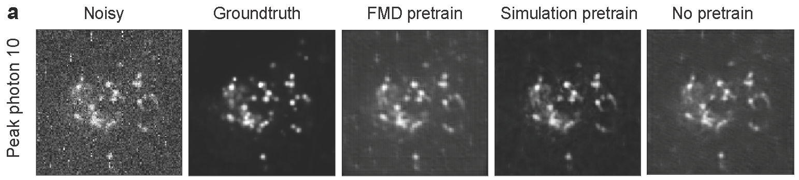

<p>
<center>

  </center>
</p>

# Image denoising for fluorescence microscopy by self-supervised transfer learning



## Overview

This repo contains code used for the timeUnet neural network. Based on the [Unet](https://arxiv.org/abs/1505.04597) architecture, this model was designed to denoise signal-dependent [Poisson Noise](https://en.wikipedia.org/wiki/Shot_noise), the largest source of noise in cellular-level fluorescence microscopy.


The network was initially trained on the [Fluorescence Microscopy Dataset (FMD)](https://curate.nd.edu/show/und:f4752f78z6t). In our study, further tuning is done by training on application specific data. Pixel masking, as see in [noise2self](https://github.com/czbiohub/noise2self) was also explored to produce even better denoising results.

## Getting Started

### Prerequisites

The code was developed using the following dependencies. Mileage may vary with future version, especially with future versions of [Keras](https://www.pyimagesearch.com/2019/10/21/keras-vs-tf-keras-whats-the-difference-in-tensorflow-2-0/) and [TensorFlow](https://www.tensorflow.org/guide/effective_tf2).

- ```Python==3.6```
- ```Keras==2.2.4```
- ```numpy==1.16.0```
- ```Pillow==5.4.1```
- ```scikit-image==0.14.2```
- ```scikit-learn==0.21.2```
- ```tensorflow-gpu==1.12.0```
- ```torch==1.1.0```
- ```torchvision==0.3.0```

## Usage

### Pretrained Models

Pretrained models can be found in ```Self-Supervised Training with Noise2Self/notebooks/trained_models/```. This folder contains 2 pretrained models which can be used:

- ```FMD_epoch50_model```: Model trained on the entire FMD dataset, containing 50 frames for 240 field-of-views. Synthetically generated noisy images were also generated for training.
- ```MT_simulation_iter1000_model_trained```: Refined FMD model specificaly denoising microtubule images. Training was performed on masked high signal-to-noise confocal microtubule images with synthetic noise applied.

### Demos

- Training: Run ```Self-Supervised Training with Noise2Self/notebooks/Selfsupervision comparison on peak signal.ipynb``` for a demonstration of fine-tune training for lysosome denoising
- Evaluation: Run ```Denoising Demo.ipynb``` to evaluate denoising against FMD trained and transfer-learning trained models.

### Other Applications

We suggest taking a similar approach to our paper when denoising in your applications. Using ```FMD_epoch50_model```, continue to train with noisy and clean image pairs from your specific domain. We saw great success using the noise2self method of masked image-pairing for task-specific denoising. See the paper and the noise2self code for more details.

## Contact

Questions/concerns should be initiated via Issues. For ideas/potential collaborations/etc. feel free to reach out at [bo.huang@ucsf.edu](mailto:bo.huang@ucsf.edu). See our [website](http://huanglab.ucsf.edu) for information about other projects.

## Acknowledgments

- [Yina Wang](https://github.com/yinawang28/) for developing the code
- [Emaad Khwaja](https://github.com/EmaadKhwaja/) for review and preparation 


### Citation

Please use the following citation if you decide to use in your research:

```
Image denoising for fluorescence microscopy by self-supervised transfer learning
Yina Wang, Henry Pinkard, Shuqin Zhou, Laura Waller, Bo Huang
bioRxiv 2021.02.01.429188; doi: https://doi.org/10.1101/2021.02.01.429188
```

### License 

See ```LICENSE``` about specific usage of this code.
